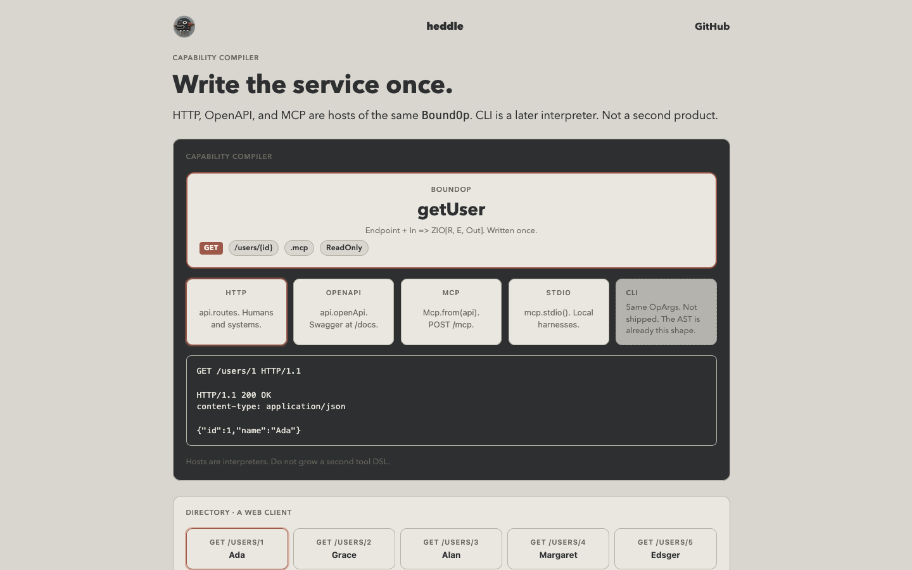

# Heddle



A capability compiler for human-centric AI service hubs.

Write a service once (`Endpoint` / `BoundOp` / `Api`) and host it for every reader that shows
up: HTTP + OpenAPI / Swagger for humans and systems, MCP 2026-07-28 for agents (HTTP and stdio
also answer the 2025-11-25 `initialize` handshake), a web UI as just another HTTP client. CLI is
a later interpreter of the same AST. Do not grow a second tool DSL.

Handlers are `Request => ZIO[R, E, Response]`. The bind is `In => ZIO[R, E, Out]`. Routing is
data. Middleware is `@@`. Loom runs accept/read/write as ordinary ZIO.

Docs (tests-as-docs, live Ascent examples): [https://www.earlyeffect.rocks/heddle/](https://www.earlyeffect.rocks/heddle/)

`import heddle.*` is a curated facade over `heddle.http`, `heddle.route`, `heddle.endpoint`,
`heddle.server`, `heddle.client`, and `heddle.error`. SSE, WebSocket, and Datastar stay in
their own packages.

## Install

Core (ZIO only):

```scala
libraryDependencies += "rocks.earlyeffect" %% "heddle" % "0.2.0"
```

Optional artifacts, same version: `heddle-mcp`, `heddle-oauth`, `heddle-brotli`.

## Routes

```scala
import heddle.*
import zio.*

val routes = Routes(
  Method.GET / "health"            -> Handler.text("ok"),
  Method.GET / "users" / int("id") -> { (id: Int) =>
    ZIO.succeed(Response.text(id.toString))
  },
)

val app = routes @@ (Middleware.requestId() ++ Middleware.cors() ++ Middleware.debug)

object Hello extends HeddleApp:
  def routes = app
```

Promote selected endpoints with `Api.job` (or `.mcp`), then `Mcp.from(api)`. Agents hit `POST /mcp` or a
`--mcp-stdio` process. Swagger is `api.openApi.routes("docs")`. A browser is an HTTP client
of `api.routes`.

## Run the example hub

```bash
sbt example/run                      # box office + OP + Swagger at /docs, UI at /preview, MCP at /mcp
sbt "example/run -- --mcp-stdio"     # same Api on stdio
```

Grok Build against the running process:

```toml
[mcp_servers.heddle-example]
url = "http://localhost:8080/mcp"
```

## Modules

| Artifact | Depends on | Role |
| --- | --- | --- |
| `heddle` | ZIO, zio-json | HTTP types, routes, middleware, Loom server, Schema, Endpoint, OpenAPI |
| `heddle-mcp` | heddle | MCP 2026-07-28 over `Api` / `BoundOp` (HTTP/stdio also answer 2025-11-25 `initialize`) |
| `heddle-oauth` | heddle | JOSE, resource server, OAuth client, OIDC provider |
| `heddle-brotli` | heddle | RFC 7932 `br` encoder / decoder (no JNI) |

JDK 21+. Full guide: [earlyeffect.rocks/heddle](https://www.earlyeffect.rocks/heddle/).
